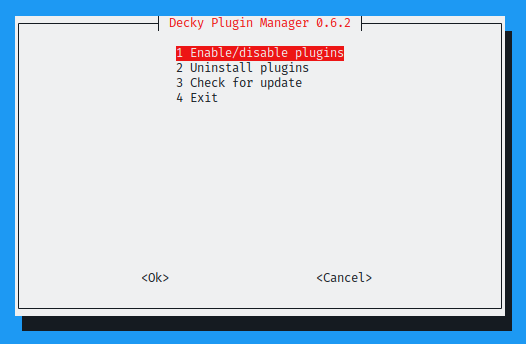
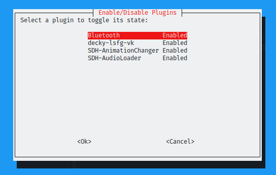

# Decky Plugin Manager 

A user-friendly tool to individually enable/disable/uninstall [Decky Loader](https://github.com/SteamDeckHomebrew/decky-loader) plugins. Features a graphical interface (whiptail) with CLI fallback. Essential when a single broken plugin prevents Decky's user interface from loading after SteamOS updates. Easy usage from Game Mode.

---

## ✨ Features
- Enable / disable individual Decky plugins
- Prevent full Decky breakage from a single bad plugin
- User-friendly GUI interface using whiptail (primary) with CLI fallback
- Graphical menus and dialogs for easy navigation
- Adds desktop launchers for the main tool, as well as the uninstaller, for easy access (Add the launchers to Steam to use in Game Mode)
- Easy installation and uninstallation
- Built-in update system

---

## 🖼️ Screenshots




---

## 🚀 Installation

### Steam Deck friendly

Provides a one-click installer from Desktop Mode. Follow these simple steps:

1. **Download the desktop launcher from here:** [Install Decky Plugin Manager](https://github.com/deckerr95/decky-plugin-manager/releases/latest/download/install-decky-plugin-manager.desktop)

    * To download a specific release, go to Releases, open the release, then download `install-decky-plugin-manager.desktop`
   

2. **Open in file manager (Dolphin)**: Navigate to your Downloads folder and double-click the `.desktop` file, then follow the steps in the installer.

**Note**: The installer supports both fresh installation and updating existing installations. It checks for existing versions and prompts for upgrade or reinstall as needed.

### Safe install via script download

For users who prefer terminal installation:

```bash
curl -fsSL https://github.com/deckerr95/decky-plugin-manager/releases/latest/download/install.sh -o /tmp/dpm-install.sh && bash /tmp/dpm-install.sh
```

Or if you want to manually inspect the script first:

```bash
curl -fsSL https://github.com/deckerr95/decky-plugin-manager/releases/latest/download/install.sh -o install.sh
# Review the script, then run:
bash install.sh
```

---

## 📱 Interface

The tool provides a user-friendly interface with two modes:

### Primary: Whiptail GUI (Recommended)
- **Graphical menus and dialogs** for easy navigation
- **Single plugin selection** interface for toggling plugin state
- **Password prompts** via secure passwordbox for sudo authentication
- **Visual feedback** with success/failure messages
- **Automatic detection**: Used when `whiptail` command is available

### Fallback: CLI Mode
- **Text-based interface** for systems without whiptail
- **Simple numbered menu** for plugin selection
- **Terminal input** for password prompts
- **Basic but functional**: Provides core functionality when GUI is unavailable

**Note**: Whiptail is detected at runtime, not installation time. The script automatically uses the best available interface for your system.

---

## Usage

### Starting the Manager
After installation:

**Desktop launcher (recommended):**
- `Decky Plugin Manager (DPM)` - Main application
- `Decky Plugin Manager (Uninstall)` - Uninstaller

**Terminal options:**
```bash
decky-plugin-manager
```
Or using the shorter alias:
```bash
dpm
```

**Tips for usage in Steam / Game Mode:**
1. Add `Decky Plugin Manager (DPM)` to Steam.
2. Go go the controller settings of `Decky Plugin Manager (DPM)` in Game Mode, then set the controller scheme to `Web browser`. After this, you should be able to navigate the menu using `DPad`, confirm using `A`, and cancel using `B`.

### Main Menu Options
When you launch the manager, you'll see the main menu with these options:

1. **Enable/disable plugins**
   - Toggle plugin state between enabled and disabled
   - Moves selected plugin between `~/homebrew/plugins` (enabled) and `~/homebrew.disabled` (disabled)
   - Visual indicator shows current state of each plugin

2. **Uninstall plugins**
   - **WARNING**: Permanently deletes selected plugins
   - Removes plugin folder from `~/homebrew/plugins`

3. **Check for update**
   - Compare local version with remote version file
   - Automatically download and install updates if available
   - Maintains your plugin configurations during update

4. **Exit**
   - Close the manager and return to desktop/terminal

### Tips for Effective Use
- **Add Decky Plugin Manager (DPM) to Steam**, then launch it easily from Game Mode

---

## 🔄 Update System

The tool includes built-in update checking functionality:

### Update Checking
- **Version comparison**: Compares local version against remote `version` file
- **Simple mechanism**: Currently checks only version difference (future improvements may add more robust checking)

### Update Process
- When an update is available, the tool downloads and executes the installer with `--update --yes` flags
- **Preserves settings**: Update process maintains your plugin configurations and preferences
- **Minimal disruption**: Updates are applied quickly with minimal user interaction

### Manual Update
You can also update manually by re-running the installation script:

```bash
curl -fsSL https://github.com/deckerr95/decky-plugin-manager/releases/latest/download/install.sh -o /tmp/dpm-install.sh && bash /tmp/dpm-install.sh
```

**Note**: The update system is designed to be simple and reliable, focusing on the essential function of keeping the tool current.

---

## Uninstall

Run the desktop launcher `Decky Plugin Manager (Uninstall)`

Or run:

```bash
decky-plugin-manager --uninstall
```

This removes:

* Installed binary
* Symlink (`dpm`)
* Desktop launchers (`*.desktop`)

---

## Install location

Main binary + symlink:

```bash
~/.local/bin/decky-plugin-manager
~/.local/bin/dpm
```

Desktop launchers:

```bash
~/.local/share/applications/dpm.desktop
~/.local/share/applications/dpm-uninstall.desktop
```

---

## Requirements

### Essential
* **bash** - Shell environment
* **curl** - For downloading the installer (already available on Steam Deck/Bazzite)
* **sudo** - Required when plugin directories are root-owned (common after manual Decky installation)
* **whiptail** - Provides graphical menus and dialogs (primary interface). Should be present by default on all major distros, especially SteamOS and Bazzite.

### Notes
* sudo prompts are cached for a few minutes after authentication (standard sudo behavior, the script doesn't store any credentials). Usually the first plugin toggle/uninstall operation requires sudo password, the ones after that don't.
* I considered implementing a menu option that takes ownership of all plugin directories to the current user (usually `deck`), that would result in DPM not asking for root password repeatedly (until you install a new plugin, that will be owned by root of course), but AFAIK plugin directories being owned by `root` is an intentional security design choice by the developers of Decky, so I decided not to go forward with this.
* The tool automatically uses the best available interface for your system

---

## How it works

The manager provides a simple but effective plugin management system:

### Plugin Toggling Mechanism
- **Scans Decky plugin directories**:
  - `~/homebrew/plugins` (active plugins)
  - `~/homebrew.disabled` (disabled plugins, created automatically if missing)
- **Moves plugin folders** between these directories to enable/disable functionality
- **Changes take full effect** after restarting Steam / Decky Loader. Otherwise, Decky may show errors that a plugin couldn't be loaded.

### Root Ownership Handling
- When plugin directories are owned by root (common after manual Decky installation), the tool will prompt for sudo password

### Directory Management
- Automatically creates `~/homebrew.disabled` directory if it doesn't exist
- Preserves all plugin files and configurations when moving between directories
- Future improvements could optimize root permission handling for smoother operation

---

## Purpose of this project

It's a common occurrence after a SteamOS update that some Decky plugins are not updated in time. This can result in Decky crashing. For users, the only real options to fix this are:

1. Going into desktop mode, opening a terminal, and deleting/moving the plugin dir from `~/homebrew/plugins/`

2. SSH-ing into the deck, and deleting/moving the plugin dir

This project aims to provide a seamless, quick and easy way of disabling/enabling individual Decky plugins.

(Similar functionality is present in the latest builds of Decky Loader, but during my testing, it's not as robust yet as of June 2026, and by the way I already started development of this tool before Decky introduced it.)

---

## 🛠️ Troubleshooting

### Common Issues

#### Plugin Management Issues
* **No plugins appear in the manager**
  1. **Decky Loader not installed**: Ensure `~/homebrew/plugins` directory exists
  2. **No plugins installed**: Install plugins through Decky Loader first
  3. **Permission issues**: Check if plugin directories are accessible
* **Permission errors when moving plugins**
  * Plugin directories owned by root: sudo password will be prompted
  * If you are on SteamOS, ensure that the `deck` user has a root password set.
  * Check `~/homebrew/plugins` ownership with `ls -la ~/homebrew/`
* **Decky complains about the plugin you disabled/uninstalled**
  * Decky needs to reload for the disabled/uninstalled plugins to be fully unloaded. Restart Steam / Steam Deck for changes to apply.

#### Update Issues
* **Update check failures**
  * Network connectivity issues
  * GitHub may be down

#### Interface Issues
* **Whiptail not working or showing basic interface**
  * Whiptail may not be installed on your system
  * Non-interactive terminal session (CLI fallback will be used)
  * Install whiptail for full GUI experience: `sudo pacman -S whiptail` (Arch-based) or `sudo apt install whiptail` (Debian-based)

---

## 📝 Notes

* **Plugin safety**: A broken plugin can crash Decky Loader; this tool isolates that issue without deleting your plugins
* **Testing status**: Tested on Bazzite on Steam Deck
* **Automatic updates**: Installation script pulls the latest version from the server
* **Directory management**: Automatically creates `~/homebrew.disabled` directory if it doesn't exist
* **KDE integration**: Installer calls `kbuildsycoca5` or `kbuildsycoca6` to refresh desktop launcher cache
* **Path handling**: Installs to `~/.local/bin/` for user installation without requiring system-wide permissions

---

Licensed under GPL-3.0-only

---

## Disclaimer

The author of this tool is not responsible for any damage, data loss, or software breakage that may occur from using this tool.
Use at your own risk. Always backup your data before making changes to your system.

This tool is provided as-is without any warranty, express or implied, including but not limited to the warranties of merchantability,
fitness for a particular purpose and noninfringement. In no event shall the author be liable for any claim, damages or other liability,
whether in an action of contract, tort or otherwise, arising from, out of or in connection with the tool or the use or other dealings in the tool.